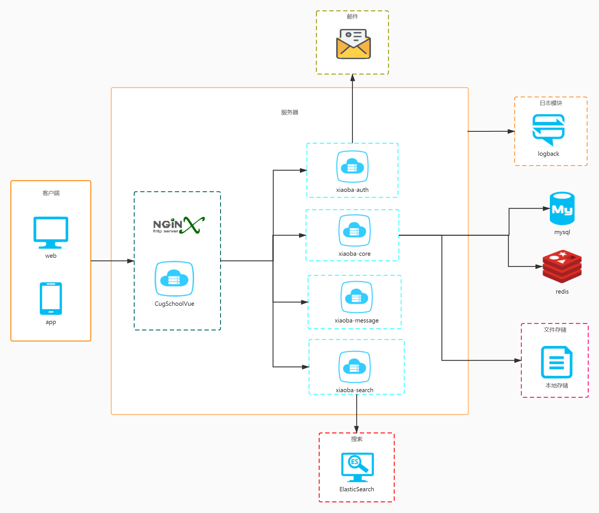

# 校吧后端代码
## 简介
校吧是大三综合大实习所写的项目,是一个基于springboot2的项目，前端使用Vue实现前后端分离。
前端代码：[传送门](https://github.com/wjf222/CugSchoolVue)

## 使用的技术
* SpringBoot 2.x 后台基本框架
* ElasticSearch 搜索层
* Shiro 鉴权层
* Redis 缓存层
* Swagger 文档
* Mybaits数据库

## 系统结构
软件体系结构设计图:

```shell
xiaoba
├── xiaoba-auth   # 权限认证模块：使用shiro，包含登录和注册
│   ├── pom.xml
│   └── src
├── xiaoba-core   # 核心模块：配置文件，Entity类，mapper类，工具类，异常过滤等
│   ├── pom.xml
│   └── src
├── xiaoba-message # 消息模块：主要是系统通知、评论、回答等消息
│   ├── pom.xml
│   └── src
├── xiaoba-search # 搜索模块：elasticSearch
│   ├── pom.xml
└── └── src
```

## 项目部署
后端环境：
* jdk1.8
* Mysql7
* Redis
* ElasticSearch
